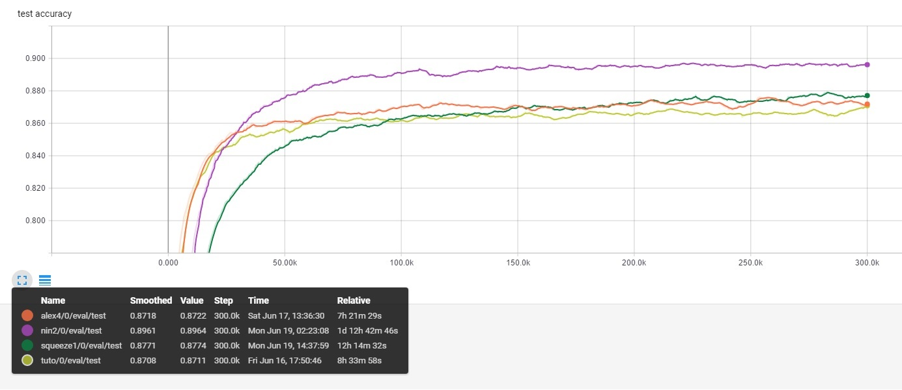

# Explore Tensorflow features with the CIFAR10 dataset

Taking the Tensorflow image tutorial as an inspiration, I developed a
generic model training framework for the CIFAR10 dataset.

As a first step, I took the same model as the tutorial, but without all
training bells and whistles.

I tried different training parameters, and finally decided to keep the ones
provided by the tutorial:
- learning rate = 0.1,
- batch size = 128.

The two main differences are the weight decay, that I deduce from each weight
matrix size, and the weights initialization: I used xavier init.

With that parameters, I achieved results a bit lower than the tutorial (for
exactly the same model):
    75,3 % accuracy after 10,000 iterations instead of 81,3%.

Then, I added data augmentation, that smoothed a lot the training process:
- drastic reduction of the overfitting,
- lower results for early iterations,
- much higher results after 5000+ iterations.

With data augmentation, the accuracy after 10,000 iterations reached 78,8%.

Finally, I used trainable variables moving averages instead of raw values, and
it gave me the extra missing accuracy to match the tutorial performance: 81,4%.

Tutorial model metrics:

Without data augmentation (32x32x3 images):

Size : 1.76 Millions of parameters
Flops: 66.98 Millions of operations

With data augmentation (24x24x3 images):

Size : 1.07 Millions of parameters
Flops: 37.75 Millions of operations

## Performance experiments

The plan was to experiment further with different models:
- ALexNet-style models that combine convolutional and dense layers,
- NiN networks that remove dense layers altogether,
- SqueezeNets that parallelize convnets,
- Inception nets (yet to be tested).

The idea was to stay within the same range in terms of computational cost and
model size, but trying to find a better compromise between model accuracy and
inference performance.

The figure below provides accuracy for the three best models I obtained,
compared to the tutorial version.

Also, examine how these models can be compressed using:
- iterative pruning,
- quantization.
